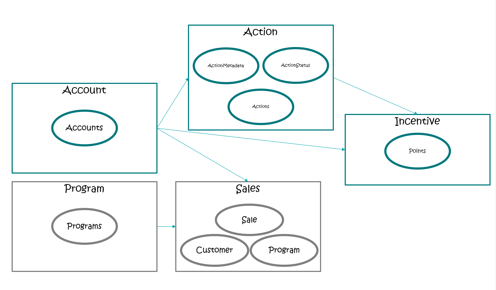

# ezLoyalty .NET Microservices Sample Reference Application

ezLoyalty is a .NET Core application, based on a simplified microservices architecture and Docker containers. 

The primary goal of this project is to build an incentive management platform to drive engagement, the project also demostrate several software-architecture concepts like:

- Microservices
- CQRS
- Event Sourcing
- Domain Driven Design (DDD)
- Eventual Consistency
- and how to use container-technologies like: >(WIP)
    - Docker
    - Kubernetes
    - Istio (service-mesh)

The architecture uses a microservice oriented architecture implementation with multiple autonomous microservices (each one owning its own data/db). The microservices also showcase different approaches from simple CRUD to more elaborate DDD/CQRS patterns. 

HTTP is the communication protocol between client apps and microservices, and asynchronous message based communication between microservices. Message queues are handled Azure Service Bus, to convey integration events. Domain events are handled in the Actions microservice, by using MediatR, a simple in-process implementation the Mediator pattern.

## Architecture overview

Below is the solution architecture to describe the different components of the application and how they interact using Azure Service Bus to communication via events.

### Internal architectural patterns

#### Common Architecture Pattern

Currently all four projects use following Visual Studio Projects.

- [name].Api
    - This projects includes the API controller/endpoints for communication including the integration events and handlers.
- [name].Domain
    - This project has includes the domain model/domain events
- [name].Infrastructure
    - This project works as database layer. Currently only SqlServer is supported but it can be extended to any database.
- [name].UnitTests
    - Unit tests cases for the above 3 projects.

#### Account Management

This service offers an API that is used to manage Customers in the system.

This service handles the following integration event:

    - AwaitingAccount - to check the validity/availability of the member in the system.

This service publishes the following events:

    - ValidationComplete - to notify if member is found in the system or not.

#### Program Management

This implementation is hard coded at this time but WIP.

#### Action Management

This service offers an API to manage all actions in the system. 

e.g. 
    - Order placed on a ecommerce website
    - Birthday action to reward members

> TBD - Rules implementation for custom actions

This service handles the following integration event:

    - ActionReceived
    - AccountValidationComplete
    - ProgramEligibilityConfirmed/Rejected
    - RewardsConfirmed/Rejected

This service publishes the following events:

    -   AwaitingAccountValidation 
    -   AwaitingEligibilityValidation
    -   AwaitingRewards

#### Incentive Management

This service offers an API to manage points assigned for the given action.

This service handles the following integration event:
    
    -   AwaitingRewards

This service publishes the following events:

    -   Rewarded

### Domain Model

## Getting Started